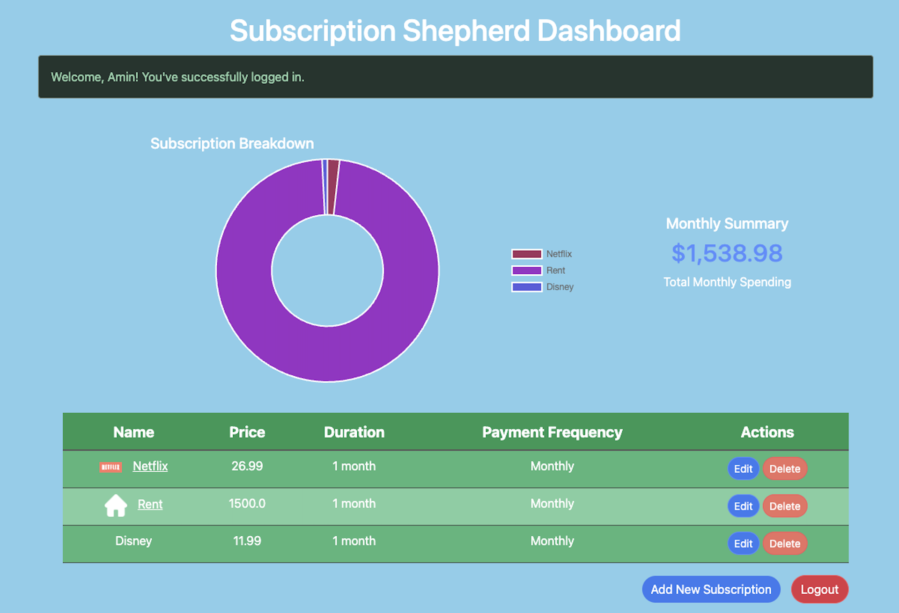

# 📊 Subscription Shepard
 
A full-stack subscription tracker built as a team capstone, independently containerized, manually deployed to production cloud infrastructure to understand the mechanics, then wired into a fully automated, keyless CI/CD pipeline.
 
[](https://www.oracle.com/java/)
[](https://spring.io/projects/spring-boot)
[](https://www.docker.com/)
[](https://cloud.google.com/run)
[](https://github.com/features/actions)
[](LICENSE)
[](https://subscription-shepard-210493677553.us-central1.run.app)
 
**[Live Demo](https://subscription-shepard-210493677553.us-central1.run.app)** · **[Deployment Docs](docs/DEPLOYMENT.md)** · **[Troubleshooting Log](docs/TROUBLESHOOTING.md)**
 

 
---
 
## At a Glance
 
- **Deployed by hand first** configured the Cloud Run service, runtime identity, and networking manually through the GCP Console to understand each piece, before automating anything
- **Short-lived Google Cloud credentials** CI/CD authenticates via Workload Identity Federation, not downloaded keys
- **Containerized with a multi-stage Docker build**, verified locally before every deploy
- **Push-to-deploy pipeline** every merge to `main` builds and ships automatically via GitHub Actions
- **Every real bug documented** with root cause and fixes, see the [troubleshooting log](docs/TROUBLESHOOTING.md)
---
 
## What It Does
 
Users register an account, log in, and track recurring subscriptions such as netflix, disney, rent, and more. With a live dashboard showing total monthly spend and a visual breakdown by service using a donut chart.
 
Originally built as a 4-person capstone project at Metropolitan State University. I independently took it further: containerized it, hardened the security posture, and shipped it to production cloud infrastructure with automated deployment.
 
---
 
## Tech Stack
 
| Layer | Technology |
|---|---|
| Backend | Java 17 · Spring Boot 3 · Spring Security · Spring Data JPA |
| Frontend | Thymeleaf · Bootstrap · Chart.js |
| Database | H2 (in-memory, stateless container design) |
| Containerization | Docker (multi-stage build) |
| Cloud Infrastructure | Google Cloud Run · Artifact Registry |
| CI/CD | GitHub Actions + GCP Workload Identity Federation |
 
---
 
## Engineering Highlights
 
> [!IMPORTANT]
> **Keyless CI/CD.** GitHub Actions authenticates to Google Cloud using GitHub OIDC and Workload Identity Federation rather than storing a long-lived Google Cloud service-account key. The federated identity is restricted to the `Aminm246/subscription-shepard` repository. Authentication uses short-lived Google Cloud credentials, with any temporary credential configuration generated on the ephemeral GitHub-hosted runner automatically cleaned up after the workflow. No long-lived service-account credentials are stored in GitHub Secrets or committed to the repository.
 
**Manual-first infrastructure setup**
Rather than scripting the initial deployment blind, the Cloud Run service, its dedicated runtime service account, and networking/scaling settings were all configured by hand through the GCP Console. Building a real working understanding of each setting before automating any of it.
 
**Two-identity IAM model**
The app's runtime identity (`subscription-shepard-runner`) and the CI/CD deploy identity (`github-deployer`) are deliberately separate, least-privilege service accounts. The deploy pipeline can *ship* a new revision, but has no broader access than that.
 
**Stateless database design**
Migrated from file-based to in-memory H2 to match Cloud Run's ephemeral container filesystem with a deliberate trade-off, explicitly documented rather than hidden. Full reasoning in [`docs/DEPLOYMENT.md`](docs/DEPLOYMENT.md).
 
**Multi-architecture Docker build**
Base images support both local ARM development (Apple Silicon) and Cloud Run's amd64 production runtime which were diagnosed and fixed a real platform bug during development.
 
**Cost-conscious infrastructure**
Runs entirely within GCP's always-free tier, backed by budget alerts and hard spend caps as safety nets against runaway cost.
 
---
 
## Running Locally
 
**Maven**
```bash
./mvnw spring-boot:run
```
Visit `http://localhost:8080`
 
**Docker** *(identical to how Cloud Run runs it)*
```bash
docker build -t subscription-shepard .
docker run -p 8080:8080 -e PORT=8080 subscription-shepard
```
 
---
 
## Project Structure
 
```
src/main/java/edu/metro/subscriptionshepard/    → application code
src/main/resources/templates/                   → Thymeleaf views
docs/                                           → deployment & troubleshooting documentation
Dockerfile                                      → multi-stage container build
```
 
---
 
## Deep Dives
 
| Document | What's Inside |
|---|---|
| [`docs/DEPLOYMENT.md`](docs/DEPLOYMENT.md) | Full architecture, manual setup process, security model, and cost controls |
| [`docs/TROUBLESHOOTING.md`](docs/TROUBLESHOOTING.md) | Real bugs hit during deployment with symptoms, root causes, fixes |
 
---
 
## Credits
 
Built by **Amin Mohamed**, Nicole Golden, Jaileia Yang, and Abdishakur Abdi as a capstone project for Metropolitan State University.
 
Cloud deployment, containerization, and CI/CD automation independently implemented by **Amin Mohamed**.
 
---
 
**License:** MIT
